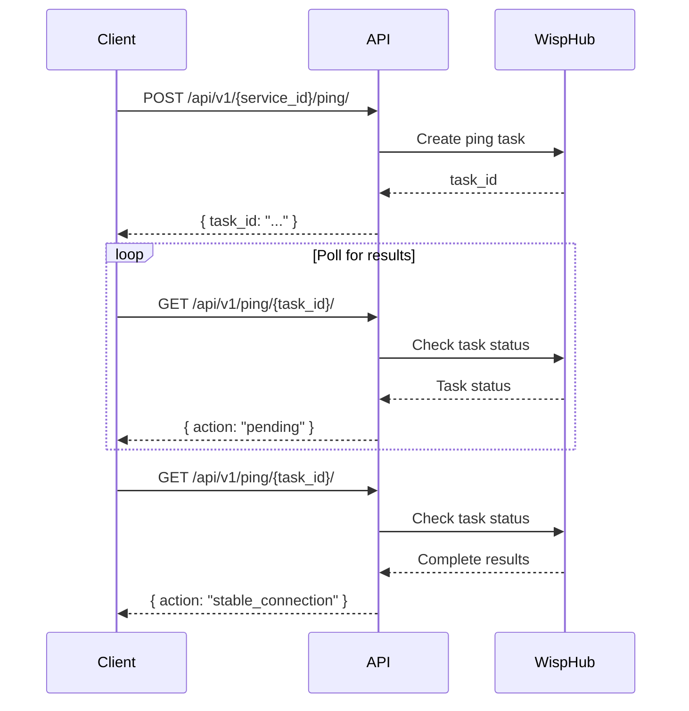

## GET /api/v1/ping/{task_id}/

Retrieves the resolved result of a previously initialized PING task. This endpoint interprets the packet loss level from results returned by WispHub (e.g., packets sent vs. received) to determine if the connection is Stable, Intermittent, or if there is no internet service at the client's end.

<Note>
This endpoint should be called after creating a ping task using the [Create Ping Task](/api-reference/network/create-ping) endpoint. Poll this endpoint until you receive a final status.
</Note>

### Path Parameters

<ParamField path="task_id" type="string" required>
  ID of the task generated when creating the ping. This is returned in the `data.task_id` field from the create ping endpoint.
</ParamField>

### Response

<ResponseField name="ok" type="boolean" required>
  Indicates whether the request was successful
</ResponseField>

<ResponseField name="type" type="string" required>
  Response type. Values: `success`, `error`, `info`
</ResponseField>

<ResponseField name="action" type="string" required>
  Specific action identifier indicating the connection status:
  - `stable_connection` - Connection is stable (low packet loss)
  - `intermittent_connection` - Connection is unstable (partial packet loss)
  - `no_internet` - No internet service detected (complete packet loss)
  - `ping_failed` - Task failed or error occurred
</ResponseField>

<ResponseField name="data" type="object">
  Response data object (typically null for this endpoint as status is conveyed via the `action` field)
</ResponseField>

<ResponseField name="message" type="string">
  Optional message providing additional context
</ResponseField>

<ResponseField name="meta" type="object">
  Optional metadata object
</ResponseField>

### Connection Status Types

The endpoint analyzes packet loss to determine connection quality:

<Expandable title="stable">
  **Stable Connection** - The connection is working properly with minimal or no packet loss. The client device is reachable and responding consistently to ping requests.
  
  Response: `type: "success"`, `action: "stable_connection"`
</Expandable>

<Expandable title="intermittent">
  **Intermittent Connection** - The connection is unstable with partial packet loss. Some ping packets are reaching the client device, but others are being dropped, indicating network issues.
  
  Response: `type: "info"`, `action: "intermittent_connection"`
</Expandable>

<Expandable title="no_internet">
  **No Internet** - No internet service detected. Complete or near-complete packet loss indicates the client device is not reachable, suggesting a service outage or equipment failure.
  
  Response: `type: "info"`, `action: "no_internet"`
</Expandable>

<Expandable title="error">
  **Error** - The ping task encountered an error during execution. This could be due to invalid task ID, task timeout, or internal processing errors.
  
  Response: `type: "error"`, `action: "ping_failed"`
</Expandable>

<Expandable title="pending">
  **Pending** - The task is still being processed. Continue polling this endpoint until a final status is returned.
  
  Response: Task may still be running; continue polling.
</Expandable>

### Example Request

<CodeGroup>

```bash curl
curl -X GET https://api.wisphub.com/api/v1/ping/550e8400-e29b-41d4-a716-446655440000/
```

```python Python
import requests
import time

url = "https://api.wisphub.com/api/v1/ping/550e8400-e29b-41d4-a716-446655440000/"

# Poll for results
max_attempts = 10
for attempt in range(max_attempts):
    response = requests.get(url)
    result = response.json()
    
    if result['action'] != 'pending':
        print(f"Final status: {result['action']}")
        break
    
    time.sleep(2)  # Wait 2 seconds before next poll
```

```javascript JavaScript
const taskId = '550e8400-e29b-41d4-a716-446655440000';
const url = `https://api.wisphub.com/api/v1/ping/${taskId}/`;

const response = await fetch(url, {
  method: 'GET'
});

const data = await response.json();
console.log(data);
```

</CodeGroup>

### Example Responses

<CodeGroup>

```json Stable Connection
{
  "ok": true,
  "type": "success",
  "action": "stable_connection",
  "data": null,
  "message": null,
  "meta": null
}
```

```json Intermittent Connection
{
  "ok": true,
  "type": "info",
  "action": "intermittent_connection",
  "data": null,
  "message": null,
  "meta": null
}
```

```json No Internet
{
  "ok": true,
  "type": "info",
  "action": "no_internet",
  "data": null,
  "message": null,
  "meta": null
}
```

```json Error
{
  "ok": false,
  "type": "error",
  "action": "ping_failed",
  "data": null,
  "message": null,
  "meta": null
}
```

</CodeGroup>

### Polling Best Practices

<Info>
Since ping tasks are processed asynchronously, implement a polling strategy with the following guidelines:
</Info>

- **Initial Delay**: Wait 2-3 seconds after creating the task before the first poll
- **Polling Interval**: Poll every 2-5 seconds to balance responsiveness and server load
- **Maximum Attempts**: Set a reasonable limit (e.g., 20 attempts = ~60 seconds max wait)
- **Exponential Backoff**: Consider increasing the delay between polls over time
- **Error Handling**: Stop polling when receiving a final status (`stable_connection`, `intermittent_connection`, `no_internet`, or `ping_failed`)

### Workflow Example



### Status Codes

- `200` - Request successful (check `action` field for connection status)
- `401` - Unauthorized (invalid or missing token)
- `404` - Task not found (invalid task_id)
- `500` - Internal server error
